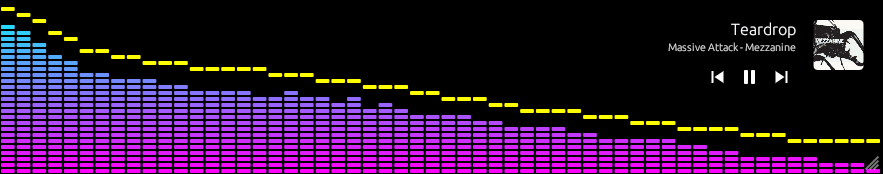
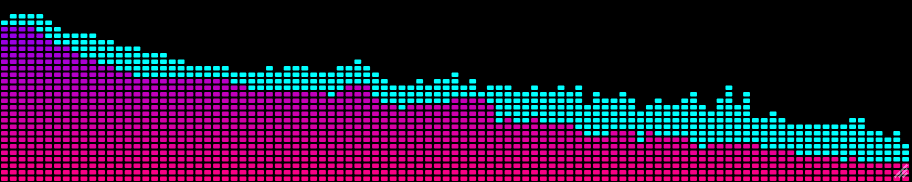

# BeSpec

[](https://opensource.org/licenses/MIT)
[](https://github.com/BeSpec-Dev/bespec/actions/workflows/release.yml)
[](https://github.com/BeSpec-Dev/bespec/actions/workflows/ci.yaml)
[]()

A high-performance, cross-platform, real-time audio spectrum visualizer written in **Rust**.

BeSpec captures system audio loopback and renders a customizable frequency spectrum overlay. It is architected for low latency, minimal resource footprint, and visual precision.



---

## Features

* **High Performance Engine:** Built with `egui` (immediate mode GUI) and `realfft` for low-latency rendering and frequency processing.
* **Cross-Platform Audio Capture:**
    * Native capture via `cpal` for Windows (WASAPI), Linux (ALSA/Pulse/Jack), and macOS (CoreAudio).
    * **Hot-Swappable Devices:** Switch input sources and refresh hardware lists in real-time without application restarts.
* **Visualization Modes:**
    * **Solid Bars:** Smooth gradients with adjustable opacity.
    * **Retro LED:** Segmented bars with customizable height and gaps, including a "Fill to Peak" warning mode.
    * **Line Spectrum:** A continuous, glowing frequency contour.
    * **Oscilloscope:** Real-time raw waveform monitoring in the time domain.
* **Precision FFT:** Uses a fixed 2048-point FFT for granular resolution (23.4 Hz/bin @ 48kHz) with configurable Attack/Release and Peak Hold dynamics.
* **Theming Engine:** A revamped system handling 25+ presets (e.g., **Winamp Classic**, **Gameboy**, **O-Scope**) and custom user profiles independently.
* **Media & Wikipedia Integration:** * Displays track metadata and full-color album art. 
    * Clicking album art triggers an intelligent Wikipedia search for the artist or album.
    * Native transport controls (Play/Pause/Skip) for Windows and Linux.
* **Interactive Inspector:** Hover over the spectrum to activate a precision crosshair displaying exact frequency (Hz) and amplitude (dB) metrics for individual bins.
* **Modern Desktop Integration:**
    * **BeOS / Haiku Mode:** A distinct window style inspired by the classic BeOS interface.
    * **Borderless Overlay:** Transparent, chrome-less window with "Always on Top" and "Click-through" support.

| **Solid Bars** | **Retro LED** |
| :---: | :---: |
|  |  |

| **Line Spectrum** | **Oscilloscope** |
| :---: | :---: |
|  |  |

## Case Studies

BeSpec is designed for audio analysis. See how it uncovers hidden artifacts in professional production:

* **[Queens of the Stone Age Analysis](./docs/case_study.md):** Using high-resolution mode to detect a 15.75 kHz CRT whine hidden in the outro of *I Was a Teenage Hand Model*.

## Compatibility

| Platform | Support Status | Media Capabilities |
| :--- | :--- | :--- |
| **Windows** | ✅ Fully Supported | Metadata, Album Art, & Transport Controls. |
| **Linux** | ✅ Fully Supported | Metadata, Album Art, & Transport (MPRIS). |
| **macOS** | ⚠️ Beta / RC | Metadata & Album Art only. |

## Installation & Usage

### Pre-built Binaries
1. Visit the [Releases Page](../../releases/latest).
2. Download the binary for your architecture (Windows `.exe`, macOS Silicon/Intel, or Linux).
3. Linux/macOS users: `chmod +x bespec` before running.

*Note: macOS and Linux users require loopback configuration. See the [macOS Setup Guide](docs/macos_setup.md) or [Linux Setup Guide](docs/linux_setup.md).*

### Build from Source
Requires the [Rust toolchain](https://www.rust-lang.org/tools/install).

```bash
git clone https://github.com/BeSpec-Dev/bespec.git
cd bespec
# Ubuntu/Debian dependencies: libasound2-dev libudev-dev pkg-config
cargo run --release
```

### Architecture
BeSpec utilizes a concurrent model to ensure the UI remains responsive at 60+ FPS:

- **Audio Thread**: Stream capture and format normalization (I16/U16/F32).
- **FFT Thread**: Signal processing via realfft with Hann windowing.
- **GUI Thread**: Immediate-mode rendering via egui + wgpu.
- **Synchronization**: `crossbeam_channel` for high-frequency data and `Arc<Mutex<SharedState>>` for configuration.

## Privacy & Network Activity

BeSpec is architected to be a privacy-first tool. All audio processing occurs locally in real-time. To support its feature set, the application performs the following minimal network requests:

* **Update Checker:** Queries the GitHub API (`api.github.com`) once on startup to check for new releases.
* **Album Art Fetching:** If your media player provides a web URL for artwork (typical for Spotify or streaming services), BeSpec downloads the image file to display it in the overlay.
* **Wikipedia Integration:** When you click the album art, BeSpec sends the current Artist and Album metadata to the Wikipedia Search API (`en.wikipedia.org`) to locate the relevant article. This only occurs upon a user click.

**Privacy Promise:** No audio data, personal identifiers, or telemetry is ever recorded, stored, or transmitted to any third party.

**Why does my OS say the "Microphone" is on?** Operating systems (*Linux and MacOS*) classify any audio input stream (including loopback) as "Microphone Usage." BeSpec processes all audio data locally in real-time. No audio is recorded, stored, or transmitted over the network.

---
Support
If you find this tool useful, consider [Buying Me a Coffee](https://buymeacoffee.com/bespec) to support continued development.