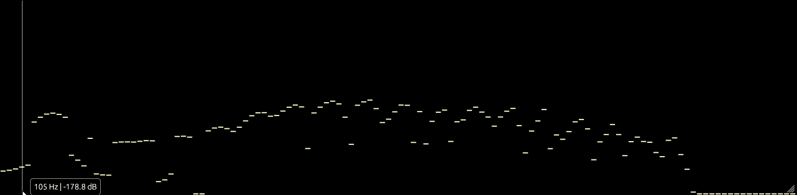

# Case Study: Artifact Analysis of Queens of the Stone Age

**Subject:** [I Was a Teenage Hand Model](https://en.wikipedia.org/wiki/Queens_of_the_Stone_Age_(album))  
**Artist:** Queens of the Stone Age  
**Album:** Self-Titled (1998)  
**Listen:** [YouTube Audio](https://www.youtube.com/watch?v=yZIcPKgNMAs)

---

## The Setup
During a listening session of the 1998 track *I Was a Teenage Hand Model*, I used BeSpec to inspect the spectral content of the song's chaotic outro.

The track begins quietly with hand percussion and piano, but ends with a deconstructed fade-out featuring aggressive synthesizer manipulation. This dynamic range provided a perfect stress test for the visualizer's ability to distinguish transient signals from constant noise floor artifacts.

## Phenomenon A: The "Wild" Sweeps
**Visibility:** Standard Resolution (64-128 bars)

As the song reaches its conclusion, at about 3:58, synthesizer notes sweep wildly up through the frequency spectrum. These are high-energy, transient events that are easily visible even at lower resolutions.

The fast response time of the `realfft` engine captures these rapid upward glissandos clearly, showing the specific slope and decay of the synth filters.

*Figure 1: The wild synth sweeps dominating the upper spectrum during the outro, 3:58.*

## Phenomenon B: The 15.75 kHz "Ghost" Signal
**Visibility:** High Resolution (512 bars)

As the music fades out, the signal-to-noise ratio improves, revealing a much subtler artifact. By increasing the **Bar Count to 512**, a static, persistent line becomes visible in the high-frequency range.

Using the **Interactive Inspector**, I isolated the bin to identify the signal:
* **Frequency:** 15.75 kHz (Steady)
* **Behavior:** Persistent throughout the track, but masked by louder instrumentation until the fade.

### Analysis
The specific frequency of **15.75 kHz** strongly suggests "CRT Whine" (the NTSC horizontal scan rate is ~15.734 kHz). It is highly likely that a computer monitor or television screen in the recording studio was bleeding high-frequency noise into the microphones or pickups during the recording session.

This artifact is effectively inaudible to the human ear in the context of the full mix, but BeSpec's high-resolution FFT exposes it clearly once the masking instruments are removed.

*Figure 2: The persistent 15.75 kHz spike visible during the quiet fade-out.*

## Conclusion
This case study demonstrates BeSpec's utility beyond aesthetic visualization. It serves as a competent diagnostic tool for audio mastering, capable of revealing:
1.  **Transient Dynamics:** Fast-moving synth sweeps.
2.  **Static Artifacts:** Low-level noise pollution (CRT whine) that survives the mastering process.