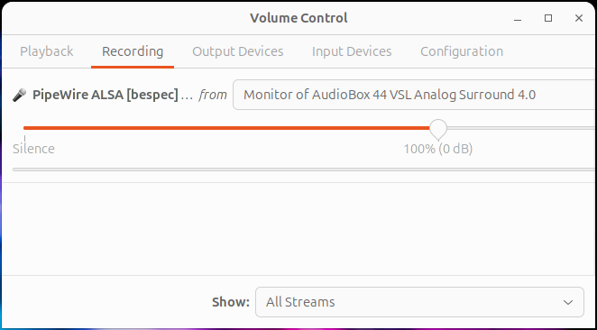

# 🐧 Linux Setup Guide

Running a system audio visualizer on Linux requires a bit of configuration to ensure the application has the correct permissions and can "hear" your desktop audio.

This guide covers installation, dependencies, and how to route your desktop audio into BeSpec.

---

## 1. Install Dependencies

Before running BeSpec, you need to ensure your system has the necessary audio and GUI libraries installed. Even though the app is a standalone binary, it relies on these system libraries.

### Ubuntu / Debian / Pop!_OS / Mint
```bash
sudo apt update
sudo apt install pkg-config libasound2-dev libdbus-1-dev libudev-dev pavucontrol
```
* `libasound2-dev`: ALSA Audio backend.
* `libdbus-1-dev`: Required for media player controls (MPRIS).
* `pavucontrol`: The standard GUI for routing audio streams (critical for Step 3).

### Fedora
```bash
sudo dnf install pkgconf-pkg-config alsa-lib-devel dbus-devel systemd-devel pavucontrol
```

### Arch Linux / Manjaro
```bash
sudo pacman -S pkgconf alsa-lib dbus systemd pavucontrol
```

---

## 2. Installation

We provide a pre-packaged installer that sets up the binary, icon, and application menu shortcut for you.

1.  **Download the Release:**
    Go to the [Releases Page](https://github.com/bespec-dev/bespec/releases) and download the file ending in `linux.tar.gz`.

2.  **Extract the Archive:**
    Right-click the file and select "Extract Here", or run:
    ```bash
    tar -xzvf bespec-*.linux.tar.gz
    ```

3.  **Run the Installer:**
    Open your terminal inside the extracted `bespec-dist` folder and run:
    ```bash
    ./install.sh
    ```
    * This installs the app to `~/.local/bin/bespec`.
    * This installs the icon to `~/.local/share/icons/bespec.png`.
    * This creates a shortcut in your Application Menu.

4.  **Launch:**
    You can now find **BeSpec** in your system's application launcher (Super/Windows Key) just like any other app.

---

## 3. Audio Routing (Crucial Step)

By default, Linux apps try to record from your **Microphone**. To visualize music from system sound sources, you must tell the system to capture the **Monitor** of your speakers instead.

**If you see a flat line or only noise when playing music, follow these steps:**

1.  **Start BeSpec** and play some music (Spotify, YouTube, etc.).
2.  Open **PulseAudio Volume Control** (Run `pavucontrol` in your terminal or app menu).
3.  Navigate to the **Recording** tab.
4.  Find **BeSpec** in the list of recording apps.
5.  Click the drop-down menu next to it (it usually says "Built-in Audio Analog Stereo").
6.  Select **"Monitor of Built-in Audio Analog Stereo"** (or "Monitor of [Your Headphones]").



*Note: If you are using **PipeWire**, this setting is usually remembered for next time.*

---

## 4. Wayland vs. X11

BeSpec runs natively on Wayland, but because Wayland compositors (like GNOME or KDE) handle windows differently than X11, you may notice the following:

* **Window Positioning:** On Wayland, the OS compositor decides where the window appears. BeSpec will not "force" itself to a saved X/Y coordinate on startup to avoid conflicts with your desktop's window management.
* **Position Saving:** Position saving is automatically disabled when a Wayland session is detected to prevent the configuration file from being overwritten with inaccurate coordinates.
* **Forcing XWayland:** If you require strict coordinate-based positioning or experience issues with window borders, you can force XWayland mode by setting this environment variable before launching:
    ```bash
    WINIT_UNIX_BACKEND=x11 bespec
    ```

---

## 5. KDE Plasma: Window Rules (Recommended)

If you are using the KDE Plasma desktop, it is highly recommended to use **Window Rules** to manage BeSpec’s behavior, especially on Wayland:

* **Bypass Compositor:** You can create a rule for BeSpec to "Ignore requested geometry" or "Force position/size" if the compositor is moving the window unexpectedly.
* **Keep Above:** Since BeSpec is a visualizer, setting a rule for "Keep Above" ensures it stays visible over your other windows.
* **Appearance:** You can use rules to force the window to be "No titlebar and frame" if you want a cleaner look regardless of the internal app settings.# 🐧 Linux Setup Guide

Running a system audio visualizer on Linux requires a bit of configuration to ensure the application has the correct permissions and can "hear" your desktop audio.

This guide covers installation, dependencies, and how to route your desktop audio into BeSpec.

---

## 1. Install Dependencies

Before running BeSpec, you need to ensure your system has the necessary audio and GUI libraries installed. Even though the app is a standalone binary, it relies on these system libraries.

### Ubuntu / Debian / Pop!_OS / Mint
```bash
sudo apt update
sudo apt install pkg-config libasound2-dev libdbus-1-dev libudev-dev pavucontrol
```
* `libasound2-dev`: ALSA Audio backend.
* `libdbus-1-dev`: Required for media player controls (MPRIS).
* `pavucontrol`: The standard GUI for routing audio streams (critical for Step 3).

### Fedora
```bash
sudo dnf install pkgconf-pkg-config alsa-lib-devel dbus-devel systemd-devel pavucontrol
```

### Arch Linux / Manjaro
```bash
sudo pacman -S pkgconf alsa-lib dbus systemd pavucontrol
```

---

## 2. Installation

We provide a pre-packaged installer that sets up the binary, icon, and application menu shortcut for you.

1.  **Download the Release:**
    Go to the [Releases Page](https://github.com/bespec-dev/bespec/releases) and download the file ending in `linux.tar.gz`.

2.  **Extract the Archive:**
    Right-click the file and select "Extract Here", or run:
    ```bash
    tar -xzvf bespec-*.linux.tar.gz
    ```

3.  **Run the Installer:**
    Open your terminal inside the extracted `bespec-dist` folder and run:
    ```bash
    ./install.sh
    ```
    * This installs the app to `~/.local/bin/bespec`.
    * This installs the icon to `~/.local/share/icons/bespec.png`.
    * This creates a shortcut in your Application Menu.

4.  **Launch:**
    You can now find **BeSpec** in your system's application launcher (Super/Windows Key) just like any other app.

---

## 3. Audio Routing (Crucial Step)

By default, Linux apps try to record from your **Microphone**. To visualize music from system sound sources, you must tell the system to capture the **Monitor** of your speakers instead.

**If you see a flat line or only noise when playing music, follow these steps:**

1.  **Start BeSpec** and play some music (Spotify, YouTube, etc.).
2.  Open **PulseAudio Volume Control** (Run `pavucontrol` in your terminal or app menu).
3.  Navigate to the **Recording** tab.
4.  Find **BeSpec** in the list of recording apps.
5.  Click the drop-down menu next to it (it usually says "Built-in Audio Analog Stereo").
6.  Select **"Monitor of Built-in Audio Analog Stereo"** (or "Monitor of [Your Headphones]").


*Note: If you are using **PipeWire**, this setting is usually remembered for next time.*

---

## 4. Wayland vs. X11

BeSpec runs natively on Wayland, but because Wayland compositors (like GNOME or KDE) handle windows differently than X11, you may notice the following:

* **Window Positioning:** On Wayland, the OS compositor decides where the window appears. BeSpec will not "force" itself to a saved X/Y coordinate on startup to avoid conflicts with your desktop's window management.
* **Position Saving:** Position saving is automatically disabled when a Wayland session is detected to prevent the configuration file from being overwritten with inaccurate coordinates.
* **Forcing XWayland:** If you require strict coordinate-based positioning or experience issues with window borders, you can force XWayland mode by setting this environment variable before launching:
    ```bash
    WINIT_UNIX_BACKEND=x11 bespec
    ```

---

## 5. KDE Plasma: Window Rules (Recommended)

If you are using the KDE Plasma desktop, it is highly recommended to use **Window Rules** to manage BeSpec’s behavior, especially on Wayland:

* **Bypass Compositor:** You can create a rule for BeSpec, dictating size and position.
* **Keep Above:** This may be helpful, in case BeSpec's *always on top* setting is squashed by Wayland.

---

## 6. Troubleshooting

### "ALSA lib pcm_dmix.c... unable to open slave"
* **Cause:** These are harmless warnings from the underlying audio driver when it scans virtual devices.
* **Fix:** You can safely ignore them. If the app runs, it works.

### Permissions Errors
If you cannot capture audio at all, ensure your user is part of the audio group:
```bash
sudo usermod -a -G audio $USER
```
*(You will need to log out and log back in for this to take effect.)*

---

## 6. Troubleshooting

### "ALSA lib pcm_dmix.c... unable to open slave"
* **Cause:** These are harmless warnings from the underlying audio driver when it scans virtual devices.
* **Fix:** You can safely ignore them. If the app runs, it works.

### Permissions Errors
If you cannot capture audio at all, ensure your user is part of the audio group:
```bash
sudo usermod -a -G audio $USER
```
*(You will need to log out and log back in for this to take effect.)*